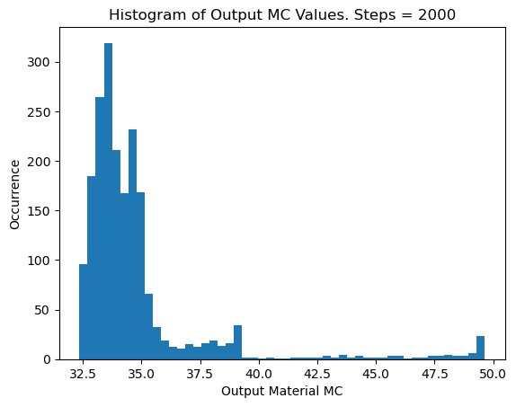

# Biomass Dryer RL Control System

Reinforcement learning-based control system for sawdust drying operations, targeting 35% moisture content in output material.

## Project Structure

```
RL/
├── tcn_rnn_ppo/
│   ├── biomass_dryer_env/
│   │   └── biomass_dryer_env.py    # Custom Gym environment
│   ├── tcn_models/
│   │   └── ntrgt_tcn_model.py      # TCN architecture for state prediction
│   ├── utils/
│   │   └── tools.py                # Helper functions
│   ├── 1_train_zscore_ntrgt_tcn_2sec.ipynb  # Step 1: Train TCN models
│   ├── 2_train_rnn_ppo.ipynb                # Step 2: Train RL agent
│   └── 3_eval_rnn_ppo.ipynb                 # Step 3: Evaluate agent
├── models/                          # Saved model weights
└── figures/
```

## Training Pipeline

### Step 1: Train TCN Surrogate Models (`1_train_zscore_ntrgt_tcn_2sec.ipynb`)

Trains Temporal Convolutional Networks (TCN) to predict next-state dynamics from historical dryer data.

**Target Variable Groups:**
| Group | Variables |
|-------|-----------|
| hist_p1 | Output MC, Output Temp |
| hist_p2 | Input MC, Input Temp |
| hist_p3 | Vibe Temp, Exhaust Temp |
| hist_p4 | MC Process Variable, MC Setpoint |
| wip_p1 | Distance, Particles |
| wip_p2 | Particle size distributions (X50, Xc, D01-D99) |
| wip_p3 | Size fractions (3mm-14mm) |

**TCN Configuration:**
- Sequence length: 510 timesteps (2-sec intervals)
- Architecture: 5 layers, channels [32, 32, 32, 64, 64]
- Custom dilations: [8, 16, 33, 66, 132] → Receptive field ~511
- Scaling: StandardScaler (z-score normalization)

**Output:** 7 trained TCN models (one per target group) + scalers saved as `.pkl` files

### Step 2: Train RL Agent (`2_train_rnn_ppo.ipynb`)

Trains a RecurrentPPO agent using the TCN models as the environment simulator.

**Environment (`BiomassDryerEnv`):**
- **State space:** 36 variables (all target groups combined)
- **Action space:** 4-dimensional continuous [0,1]
  - `action[0]`: Dryer temperature CV (scaled to operational range)
  - `action[1]`: Dryer feed rate (discretized to valid options)
  - `action[2]`: Supply feed rate
  - `action[3]`: Update flag (>0.5 applies new controls)

**Reward Function:**
- Target: 35% output moisture content
- Bonuses: +300 (within 1%), +150 (within 2%), +50 (within 3%)
- Penalties: Quadratic deviation from target, severe penalty for MC >36% or <30%
- Target zone tracking: +300 entering, +150 staying, penalty for drifting out

**Training Strategy (Annealed):**
```python
# Exploration annealing over 100 epochs
ent_coef:      0.01 → 0.0
log_std_init:  0.2  → 0.1
learning_rate: 1.5e-4 with 0.95 decay/epoch
```

**Hyperparameters:**
- Algorithm: RecurrentPPO (MlpLstmPolicy)
- n_steps: 512
- batch_size: 64
- gamma: 0.99
- max_timesteps/epoch: seq_len × 10

### Step 3: Evaluate Agent (`3_eval_rnn_ppo.ipynb`)

Runs evaluation episodes and generates histogram of output MC distribution.

## Usage

```python
# Load trained model
from sb3_contrib import RecurrentPPO
model = RecurrentPPO.load("path/to/model.zip")

# Create environment
env = BiomassDryerEnv(setup_info, real_time_mode=False)

# Run inference
obs, _ = env.reset()
for _ in range(steps):
    action, _ = model.predict(obs)
    obs, reward, done, truncated, info = env.step(action)
```

## Real-Time Mode

The environment supports real-time deployment via `set_real_time_state()`:

```python
env.set_to_real_time()
env.set_real_time_state(plc_states, wipware_states)
# info['ctrl_sigs'] contains control outputs to send to PLC
```

## Dependencies

- PyTorch
- Stable-Baselines3 + sb3-contrib
- Gymnasium
- scikit-learn
- pandas, numpy

## Key Files

| File | Purpose |
|------|---------|
| `biomass_dryer_env.py` | Gym environment wrapping TCN models |
| `ntrgt_tcn_model.py` | Multi-target TCN architecture |
| `tools.py` | Data loading utilities |

## Demo Evaluation Run
- Total Number of Steps: 2000
- Average output MC: 33.99

